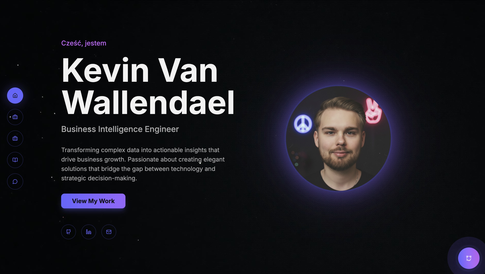

# Kevin Van Wallendael - Personal Portfolio

Welcome to the official repository for my personal portfolio website. This project is a modern, single-page application built to showcase my skills, featured projects, and professional experience as a Business Intelligence Engineer.

**[Live Demo](https://kevinvanwallendael.com/)** 



## ✨ Features

  * **Interactive Single-Page Application:** Smooth, animated navigation between sections (Home, Skills, Projects, Blog, Contact) without page reloads.
  * **AI Virtual Assistant ("W.A.L.L.Y."):** An integrated AI chatbot, powered by OpenAI and Supabase Edge Functions, capable of answering questions about my skills and projects.
  * **Fully Responsive Design:** A clean and modern UI that provides a seamless experience on all devices, from mobile phones to desktops.
  * **Dynamic Content:** Features like a multi-lingual greeting rotator and animated fun facts to create an engaging user experience.
  * **Project Showcase:** A detailed look into my key projects, complete with descriptions, technologies used, and links to live demos and GitHub repositories.

## 🛠️ Tech Stack

This portfolio is built with a modern, type-safe, and efficient technology stack:

  * **Frontend:** [React](https://react.dev/), [TypeScript](https://www.typescriptlang.org/), [Vite](https://vitejs.dev/)
  * **Styling:** [Tailwind CSS](https://tailwindcss.com/), [shadcn/ui](https://ui.shadcn.com/)
  * **Routing:** [React Router](https://reactrouter.com/)
  * **Backend Services:** [Supabase Edge Functions](https://supabase.com/) (for the AI Assistant)
  * **Deployment:** [Render](https://render.com/)

## 🚀 Getting Started

To run this project locally, follow these steps:

### Prerequisites

  * Node.js (v18 or later recommended)
  * npm or another package manager

### Installation & Setup

1.  **Clone the repository:**

    ```bash
    git clone 
    cd your-repo-name
    ```

2.  **Install dependencies:**

    ```bash
    npm install
    ```

3.  **Set up environment variables:**
    Create a `.env` file in the root of the project and add your Supabase credentials. You can get these from your Supabase project dashboard.

    ```env
    VITE_SUPABASE_URL="YOUR_SUPABASE_URL"
    VITE_SUPABASE_PUBLISHABLE_KEY="YOUR_SUPABASE_PUBLISHABLE_KEY"
    ```

4.  **Run the development server:**

    ```bash
    npm run dev
    ```

    The application will be available at `http://localhost:8080`.

## 🤖 (Deployment)

This project is configured for easy deployment on **Render**.

1.  Connect your GitHub repository to a new **Static Site** on Render.
2.  Use the following build settings:
      * **Build Command:** `npm install && npm run build`
      * **Publish Directory:** `dist`
3.  Add a **Rewrite Rule** to handle client-side routing:
      * **Source:** `/*`
      * **Destination:** `/index.html`
      * **Action:** `Rewrite`

Render will automatically build and deploy your site upon every push to your main branch.